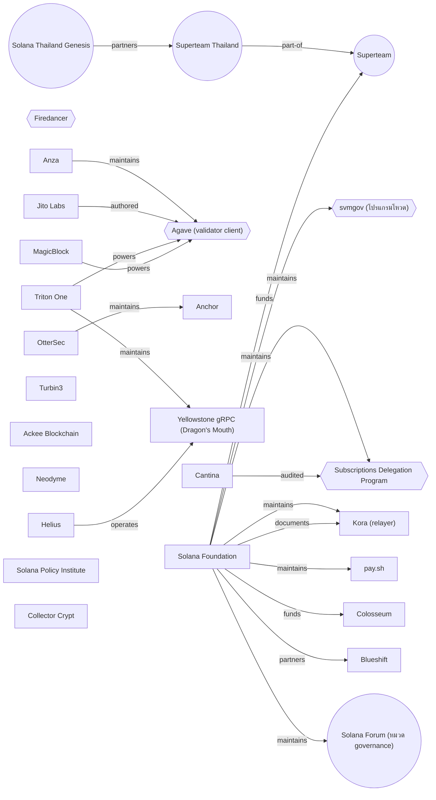

# Ecosystem Map

> ไฟล์นี้ถูก generate จาก [data/entities.yml](data/entities.yml) — **อย่าแก้ตรงนี้**
> แก้ YAML แล้วรัน `./scripts/render-graph.sh`

**27** หน่วยงาน · **19** ความสัมพันธ์ · อัปเดต 2026-08-05

ตอบคำถามที่ [CATALOG.md](CATALOG.md) ไม่ตอบ — ไม่ใช่ "ของอยู่ที่ไหน" แต่คือ **ใครทำ ใครดูแล ใครจ่ายเงิน ใครตรวจ**

> **ไม่มีข้อมูลรายบุคคลในไฟล์นี้** และกันไว้ที่ schema ไม่ใช่ที่วินัยคนกรอก —
> `entity-check.sh` จะไม่ผ่านถ้าเจอ `kind` นอกรายการปิด ซึ่งไม่มี `person` อยู่ในนั้น

## แผนภาพ

รูปทรง: สี่เหลี่ยม = องค์กร · วงกลม = ชุมชน · หกเหลี่ยม = โปรแกรม/client

## องค์กร / บริษัท / มูลนิธิ (15)

| ชื่อ | ติดต่อเรื่องอะไรได้ | ยืนยันเมื่อ |
|---|---|---|
| [Solana Foundation](https://github.com/solana-foundation) | เจ้าของ solana.com, เอกสารทางการ, ทุน grant, ปฏิทินอีเวนต์โลก — ช่องที่คนไทยเข้าถึงได้จริงโดยไม่ต้องมีคนแนะนำคือฟอร์มส่งอีเวนต์และ open application สาย engineer | 2026-08-05 |
| [Anza](https://www.anza.xyz/) | คนทำ core จริง (agave, kit, solana-sdk, pinocchio, mollusk) — เวลาข้อมูลเรื่อง client ขัดกันให้ยึดฝั่งนี้ ไม่ใช่ Foundation | 2026-08-05 |
| [OtterSec](https://github.com/solana-foundation/anchor) | ปลายทางที่ repo Anchor redirect ไป — ถ้าจะ contribute เข้า Anchor ต้องคุยฝั่งนี้ ไม่ใช่ Foundation | 2026-08-05 |
| [Helius](https://www.helius.dev/) | ผู้ให้บริการ RPC/API ที่คนไทยใช้เยอะสุดเจ้าหนึ่ง มีบล็อกที่ใช้เป็นสื่อการสอนได้จริง | 2026-08-05 |
| [Triton One](https://triton.one/) | RPC + validator ที่เปิดโค้ดจริง — เลิกใช้บริการแล้วยังรันเองต่อได้ org GitHub ชื่อ rpcpool ไม่ใช่ triton | 2026-08-05 |
| [MagicBlock](https://www.magicblock.xyz/) | Ephemeral Rollup สำหรับงาน real-time เปิดโค้ดทั้งกอง และมีเส้นทาง builder → ทุน ที่ไม่ต้องรอคนแนะนำ | 2026-08-05 |
| [Jito Labs](https://solana.com/upgrades/100m-cu-blocks) | ผู้เสนอ SIMD-0286 ที่ขยาย block limit เป็น 100M CU — ฝั่งที่ผลักดันเรื่อง throughput | 2026-08-05 |
| [Cantina](https://github.com/solana-foundation/subscriptions) | ผู้ตรวจ audit ให้โปรแกรม subscriptions — ใช้เป็นตัวอย่างว่าโปรแกรมที่ผ่าน audit หน้าตาเป็นยังไง | 2026-08-05 |
| [Blueshift](https://learn.blueshift.gg/) | คอร์สฟรีเปิดโค้ดที่ Foundation แนะนำเอง — หยิบโครงแบบฝึกไปทำ quest ต่อได้ | 2026-08-05 |
| [Turbin3](https://turbin3.org/) | cohort เข้มข้นและมีสายฝึกฟรี — ปลายทางที่ชี้ให้คนไทยที่เอาจริงไปต่อได้ | 2026-08-05 |
| [Ackee Blockchain](https://ackee.xyz/school-of-solana) | คอร์สฟรีที่มีใบรับรอง — ต่างจากที่อื่นตรงมีหลักฐานเอาไปสมัครงานได้ | 2026-08-05 |
| [Neodyme](https://neodyme.io/en/blog/) | ทีม audit ที่เขียนเคสช่องโหว่จริง — วัตถุดิบสอนความปลอดภัยที่มีน้ำหนักกว่ารายการ best practice | 2026-08-05 |
| [Colosseum](https://colosseum.com/) | แฮกกาธอน + accelerator + กองทุน — Eternal เปิดตลอดปี ไม่ต้องรอรอบ | 2026-08-05 |
| [Solana Policy Institute](https://www.solanapolicyinstitute.org/) | องค์กรนโยบาย — ใช้เป็นแม่แบบกรอบการคุยกับหน่วยงานกำกับ โดยเฉพาะประเด็นคุ้มครองนักพัฒนา | 2026-08-05 |
| [Collector Crypt](https://collectorcrypt.com/) | RWA สาย longtail ที่มีตัวเลขบนเชนให้ตรวจ — เคสสอน tokenization ที่คนไทยเข้าใจทันที | 2026-08-05 |

## ชุมชน / เครือข่ายคน (4)

| ชื่อ | ติดต่อเรื่องอะไรได้ | ยืนยันเมื่อ |
|---|---|---|
| [Superteam](https://superteam.fun/) | เครือข่าย talent ระดับภูมิภาค มี Earn (bounty) และ Talent (งาน) เป็นประตูเข้า | 2026-08-05 |
| [Superteam Thailand](https://luma.com/SuperteamTH) | chapter ไทย — ปฏิทินอีเวนต์เป็นลิงก์แรกที่ส่งให้คนถามว่าจะเริ่มยังไง | 2026-08-05 |
| [Solana Thailand Genesis](https://discord.gg/PGbUgNmsns) | ชุมชนที่ repo นี้สังกัด มีระบบ rank และ quest อยู่แล้ว — ปลายทางของเนื้อหาที่ผลิตจากแคตตาล็อกนี้ | 2026-08-05 |
| [Solana Forum (หมวด governance)](https://forum.solana.com/c/gov/11) | ที่ถกก่อนขึ้นเชน — ช่องที่คนไทยเข้าไปออกความเห็นได้โดยไม่ต้องมี stake | 2026-08-05 |

## โปรแกรมบนเชน หรือ client ระดับโปรโตคอล (4)

| ชื่อ | ติดต่อเรื่องอะไรได้ | ยืนยันเมื่อ |
|---|---|---|
| [Agave (validator client)](https://github.com/anza-xyz/agave) | client หลักของเครือข่าย — เวอร์ชันที่รันอยู่กำหนดว่าฟีเจอร์ไหนใช้ได้จริง | 2026-08-05 |
| [Firedancer](https://github.com/firedancer-io/firedancer) | client ตัวที่สองเพื่อความหลากหลาย เขียนด้วย C — ใช้ตอบคำถามเรื่องความเสี่ยงกระจุกที่ client เดียว | 2026-08-05 |
| [svmgov (โปรแกรมโหวต)](https://github.com/solana-foundation/solana-governance) | โปรแกรมที่รับโหวต SGP จริงบนเชน — เป็นตัวอย่าง production Anchor + merkle proof ที่อ่านได้ | 2026-08-05 |
| [Subscriptions Delegation Program](https://github.com/solana-foundation/subscriptions) | จ่ายรายรอบบนเชน audit แล้วขึ้น mainnet — ตัวอย่างโค้ด production สาย Pinocchio + Codama + LiteSVM | 2026-08-05 |

## เครื่องมือ / บริการ / SDK (4)

| ชื่อ | ติดต่อเรื่องอะไรได้ | ยืนยันเมื่อ |
|---|---|---|
| [Anchor](https://github.com/solana-foundation/anchor) | เฟรมเวิร์กที่คนไทยเริ่มต้นด้วยเกือบทั้งหมด — repo 301 ไป otter-sec แล้ว คนดูแลจริงเปลี่ยนมือ | 2026-08-05 |
| [Yellowstone gRPC (Dragon's Mouth)](https://github.com/orgs/rpcpool/repositories) | มาตรฐานโดยพฤตินัยของการดูดข้อมูลสด — เอกสาร indexing ทางการชี้มาที่นี่ | 2026-08-05 |
| [Kora (relayer)](https://solana.com/docs/tools/kora) | ทำให้ผู้ใช้ทำธุรกรรมได้โดยไม่ต้องมี SOL — คำตอบของกำแพงแรกที่เจอทุกเวิร์กช็อป | 2026-08-05 |
| [pay.sh](https://pay.sh/) | x402 ที่ใช้งานจริง เติมเงินผ่าน PayPal/Apple Pay ได้ — คนที่ไม่มีคริปโตเลยก็เริ่มได้ | 2026-08-05 |

## ความสัมพันธ์ทั้งหมด

| จาก | ความสัมพันธ์ | ถึง | หลักฐาน |
|---|---|---|---|
| `anza` | ดูแลพัฒนา | `agave` | [ที่มา](https://github.com/anza-xyz/agave) |
| `otter-sec` | ดูแลพัฒนา | `anchor` | [ที่มา](https://github.com/solana-foundation/anchor) |
| `solana-foundation` | ดูแลพัฒนา | `svmgov` | [ที่มา](https://github.com/solana-foundation/solana-governance) |
| `solana-foundation` | ดูแลพัฒนา | `subscriptions` | [ที่มา](https://github.com/solana-foundation/subscriptions) |
| `solana-foundation` | ดูแลพัฒนา | `kora` | [ที่มา](https://solana.com/docs/tools/kora) |
| `solana-foundation` | ดูแลพัฒนา | `pay-sh` | [ที่มา](https://pay.sh/) |
| `cantina` | ตรวจความปลอดภัยให้ | `subscriptions` | [ที่มา](https://github.com/solana-foundation/subscriptions) |
| `jito-labs` | เป็นผู้เสนอ/เขียน | `agave` | [ที่มา](https://solana.com/upgrades/100m-cu-blocks) |
| `triton-one` | ดูแลพัฒนา | `yellowstone-grpc` | [ที่มา](https://github.com/orgs/rpcpool/repositories) |
| `triton-one` | เป็นโครงสร้างพื้นฐานให้ | `agave` | [ที่มา](https://triton.one/) |
| `helius` | เป็นผู้ให้บริการ | `yellowstone-grpc` | [ที่มา](https://solana.com/docs/payments/accept-payments/indexing) |
| `superteam-thailand` | เป็นส่วนหนึ่งของ | `superteam` | [ที่มา](https://superteam.fun/) |
| `solana-foundation` | ให้ทุน | `colosseum` | [ที่มา](https://solana.org/grants) |
| `solana-foundation` | ให้ทุน | `superteam` | [ที่มา](https://solana.org/grants) |
| `solana-foundation` | ร่วมมือกัน | `blueshift` | [ที่มา](https://learn.blueshift.gg/) |
| `solana-foundation` | เป็นคนเขียนเอกสารให้ | `kora` | [ที่มา](https://solana.com/docs/tools/kora) |
| `solana-thailand-genesis` | ร่วมมือกัน | `superteam-thailand` | [ที่มา](https://luma.com/SuperteamTH) |
| `magicblock` | เป็นโครงสร้างพื้นฐานให้ | `agave` | [ที่มา](https://www.magicblock.xyz/) |
| `solana-foundation` | ดูแลพัฒนา | `solana-forum` | [ที่มา](https://forum.solana.com/c/gov/11) |

---

ทุก `evidence` ต้องเป็น URL ที่มีอยู่จริงใน [data/resources.yml](data/resources.yml)
— `entity-check.sh` บังคับข้อนี้ ทำให้กราฟอ้างอะไรที่ไม่มีของรองรับไม่ได้
